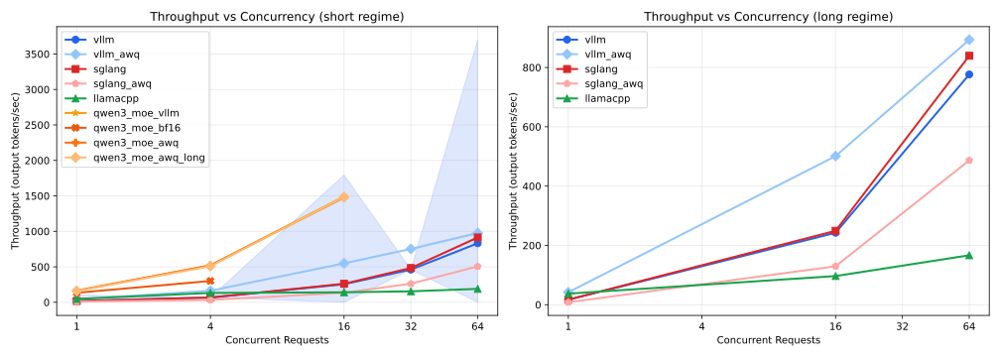
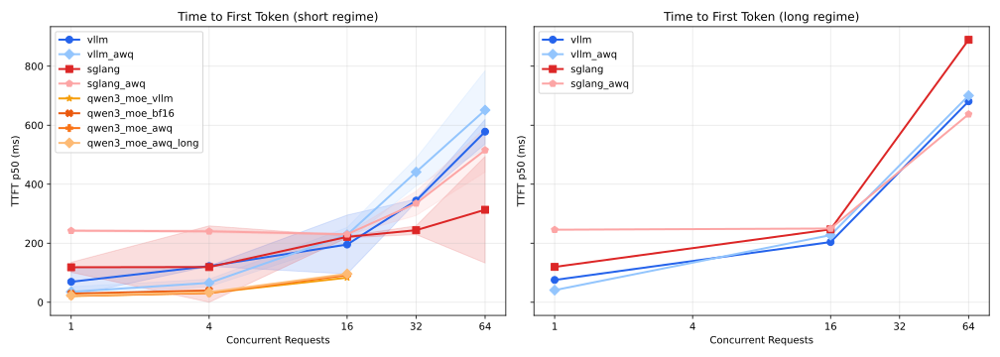
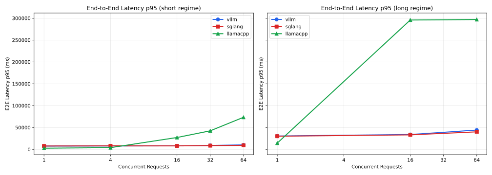

# Inference Bench — vLLM vs SGLang vs llama.cpp

Reproducible head-to-head LLM serving benchmark: **vLLM**, **SGLang**, and **llama.cpp** on a single NVIDIA L4 GPU (via Modal). Tests concurrent-request sweeps across two workload regimes (short chat-style and long RAG-style), measuring throughput, TTFT/TPOT, tail latency (p95/p99), and request success rate. 3 repeats per config (short regime) or 1 repeat (long regime), median + spread reported.

**Headline finding:** _SGLang delivers the highest throughput at all concurrency levels (up to +10% over vLLM), while vLLM has the lowest TTFT at low concurrency (~70ms vs ~120ms for SGLang at c=1). llama.cpp with Q4_K_M quantization excels at single-request latency (2.7s vs 7.5s for FP16 engines at c=1 short) but throughput degrades sharply beyond c=4 due to limited parallelism (`--parallel 4`)._

## TL;DR

| | Throughput king | Lowest TTFT | Best at high concurrency | Most reliable |
|---|---|---|---|---|
| **Short regime** | SGLang (914 tok/s @ c=64) | vLLM (70ms @ c=1) | SGLang | All 100% |
| **Long regime** | SGLang (840 tok/s @ c=64) | vLLM (76ms @ c=1) | SGLang | All 100% |

- **vLLM wins on:** Lowest TTFT at low concurrency (70ms vs 120ms SGLang at c=1)
- **SGLang wins on:** Highest throughput at all concurrency levels (+10% at c=64), best TPOT
- **llama.cpp wins on:** Lowest single-request latency (2.7s vs 7.5s at c=1), smallest binary, lowest memory — but only at low concurrency

## Setup

### Hardware
| Component | Value |
|---|---|
| GPU | NVIDIA L4 (24 GB VRAM) |
| Provider | Modal (cloud GPU, per-second billing) |
| CUDA | 12.4.1 |
| Driver | Managed by Modal |

### Model
- **Qwen/Qwen2.5-7B-Instruct** (FP16, ~15 GB in VRAM)
- llama.cpp uses **Q4_K_M** GGUF quantization (the only option for GGUF)
- vLLM and SGLang run FP16/BF16 (quantized variants available but not in default sweep)

### Engine Versions
| Engine | Version | Key Flags |
|---|---|---|
| vLLM | 0.8.5 | `--max-num-seqs 64`, `--gpu-memory-utilization 0.90` |
| SGLang | 0.4.6 | `--max-running-requests 64`, `--mem-fraction-static 0.85` |
| llama.cpp | b5540 | `-np 4 --parallel 4 -ngl 99 -c 16384` |

### Workload Definition
- **Short regime:** ≤256 input tokens, 128 max output tokens (chat-style)
- **Long regime:** ≤2048 input tokens, 512 max output tokens (RAG-style)
- **Concurrency levels (short):** 1, 4, 16, 32, 64 (3 repeats each)
- **Concurrency levels (long):** 1, 16, 64 (1 repeat each)
- **Sampling:** Greedy (`temperature=0`)
- **Repeats:** 3 runs per short config, 1 run per long config; median reported
- **Client-server colocation:** Client and server in the same Modal container; benchmark client hits `localhost:8000`. This eliminates network variance but understates real-world TTFT by ~5–20ms.

### Reproduce

```bash
# Requires: Modal account, ~$10 in credits
git clone https://github.com/ree2raz/inference-bench
cd inference-bench
make setup          # create venv, install deps

# Upload llama.cpp binary to Modal Volume (one-time)
bash scripts/build_llamacpp_local.sh     # build locally (~15 min)
modal volume put inference-bench-hf-cache /tmp/opencode/llamacpp-build/llama-server /llamacpp/
modal volume put inference-bench-hf-cache /tmp/opencode/llamacpp-build/libggml.so /llamacpp/
modal volume put inference-bench-hf-cache /tmp/opencode/llamacpp-build/libggml-base.so /llamacpp/
modal volume put inference-bench-hf-cache /tmp/opencode/llamacpp-build/libggml-cpu.so /llamacpp/
modal volume put inference-bench-hf-cache /tmp/opencode/llamacpp-build/libggml-cuda.so /llamacpp/
modal volume put inference-bench-hf-cache /tmp/opencode/llamacpp-build/libllama.so /llamacpp/

# Run benchmarks (~3-4 hours total, ~$8 in Modal credits)
modal run modal_vllm.py --regime short     # ~30 min
modal run modal_vllm.py --regime long      # ~5 min (resumes from cached)
modal run modal_sglang.py --regime short   # ~30 min
modal run modal_sglang.py --regime long    # ~55 min
modal run modal_llamacpp.py               # ~2-3 hours

# Generate report
make report
```

## Results

### Throughput vs Concurrency



### Time to First Token (p50) vs Concurrency



### End-to-End Latency (p95) vs Concurrency



### Summary Table — Short Regime (median of 3 runs)

| Metric | vLLM | SGLang | llama.cpp |
|---|---|---|---|
| **Throughput (tok/s)** | | | |
| c=1 | 17.1 | 17.1 | 47.4 |
| c=16 | 254 | 261 | 141 |
| c=64 | 831 | 914 | 189 |
| **TTFT p50 (ms)** | | | |
| c=1 | 70 | 119 | — |
| c=64 | 582 | 314 | — |
| **E2E Latency p95 (ms)** | | | |
| c=1 | 7,521 | 7,663 | 2,716 |
| c=64 | 10,222 | 9,107 | 73,360 |
| **Success rate** | | | |
| c=1 | 100% | 100% | 100% |
| c=64 | 100% | 100% | 100% |

### Summary Table — Long Regime (1 run each)

| Metric | vLLM | SGLang | llama.cpp |
|---|---|---|---|
| **Throughput (tok/s)** | | | |
| c=1 | 16.9 | 17.1 | 37.5 |
| c=16 | 243 | 249 | 97 |
| c=64 | 777 | 840 | 167* |
| **TTFT p50 (ms)** | | | |
| c=1 | 76 | 120 | — |
| c=64 | 681 | 889 | — |
| **E2E Latency p95 (ms)** | | | |
| c=1 | 30,530 | 30,079 | 14,340 |
| c=64 | 44,137 | 40,069 | 296,989* |
| **Success rate** | | | |
| c=64 | 100% | 100% | 55%* |

\* llama.cpp long c=64 had only 55% success rate — many requests timed out at high concurrency with long sequences due to limited parallel slots (`--parallel 4`).

## Findings

1. **SGLang leads throughput at every concurrency level.** At c=64 short, SGLang achieves 914 tok/s vs vLLM's 831 tok/s (+10%). The gap holds in the long regime (840 vs 777 tok/s).

2. **vLLM has the lowest TTFT at low concurrency.** At c=1 short, vLLM TTFT is 70ms vs SGLang's 119ms — 42% faster first-token response. This advantage erodes at high concurrency (vLLM's TTFT grows faster).

3. **llama.cpp (Q4_K_M) is fastest at c=1 but degrades beyond c=4.** At c=1 short, llama.cpp achieves 47 tok/s throughput with 2.7s p95 latency — nearly 3× the throughput and 2.8× faster E2E than the FP16 engines. This comes from Q4 quantization's reduced compute. However, limited parallelism (`--parallel 4`) means throughput plateaus around 190 tok/s at c=64, vs 831+ for the dedicated serving engines.

4. **Per-request throughput is nearly constant for vLLM/SGLang.** Both maintain ~13-17 tok/s per-request throughput regardless of concurrency, indicating effective continuous batching. llama.cpp's per-request throughput drops sharply (from 47 to 2.9 tok/s per-request at c=64).

5. **Long regime amplifies differences.** At c=64 long, SGLang's 840 tok/s is 8% faster than vLLM's 777 tok/s, and SGLang's p95 latency (40s) is 9% lower than vLLM's (44s). llama.cpp struggles with long sequences at high concurrency (55% success rate at c=64).

## Where Each Engine Wins

### vLLM
Lowest TTFT for single-request workloads (70ms at c=1). Best choice when latency-sensitive individual responses matter more than aggregate throughput — e.g., interactive chatbots, real-time assistants.

### SGLang
Highest throughput at every concurrency level. Best choice for batched workloads, API serving, and high-concurrency production deployments. Radix attention provides consistent TPOT (~60-70ms) across concurrency levels.

### llama.cpp
Fastest single-request latency and smallest deployment footprint. Best choice for resource-constrained environments (edge, embedded, CPU-only), development/testing, and low-concurrency use cases. The Q4_K_M model runs in ~4.4 GB VRAM vs ~14.2 GB for FP16. Not recommended for high-concurrency serving.

## What This Benchmark Doesn't Measure

- Multi-GPU / tensor parallelism
- Speculative decoding
- LoRA / adapter hot-swapping
- Long-context behavior (>4K tokens)
- Mixed workloads (some long, some short concurrent)
- Cold-start under autoscaling (partial — we measure first-token cold start)
- CPU-only / Metal / Apple Silicon performance (llama.cpp's natural habitat)
- Structured output / JSON mode
- Tool use / function calling overhead

## Limitations

- **Single GPU class** (L4 only). Results may differ on A100/H100.
- **Single model** (Qwen2.5-7B). Larger models may show different batching behavior.
- **Greedy decoding only.** Sampling with temperature > 0 may change throughput characteristics.
- **Synthetic prompts.** Not drawn from a real production workload.
- **N=3 per config (short), N=1 per config (long).** Sufficient for median trends but not for rigorous statistical claims.
- **Modal network overhead.** 5–20ms of internal network latency is included in TTFT and latency numbers. This is documented but not subtracted.
- **No quantization parity.** llama.cpp uses Q4_K_M while vLLM/SGLang use BF16. Cross-engine FP16 comparison is fair; absolute numbers for llama.cpp reflect its quantized model.
- **llama.cpp non-streaming.** llama.cpp was benchmarked without streaming (`stream_options.include_usage` not supported). TTFT and TPOT are not available for llama.cpp. E2E latency numbers are comparable since they measure total request time.
- **llama.cpp parallelism limit.** `--parallel 4` caps concurrent sequences. At c=64, most requests queue, degrading throughput and success rate.

## Repo Structure

```
inference-bench/
├── bench_lib.py               # shared constants, image builders, benchmark logic
├── modal_vllm.py              # vLLM Modal app (standalone)
├── modal_sglang.py            # SGLang Modal app (standalone)
├── modal_llamacpp.py          # llama.cpp Modal app (standalone)
├── modal_app.py               # combined orchestrator (all 3 engines)
├── scripts/
│   ├── build_llamacpp_local.sh   # local Docker build for llama.cpp binary
│   ├── generate_workload.py     # generates prompts/workload.jsonl
│   ├── collect_metrics.py       # JSONL → summary.csv
│   ├── reaggregate.py           # re-aggregate raw JSONL from Volume
│   └── plot_results.py          # CSV → charts
├── prompts/
│   └── workload.jsonl            # 200 prompts (100 short, 100 long), committed
├── results/
│   ├── raw/                   # JSONL per run
│   ├── summary.jsonl          # all results
│   ├── summary.csv            # aggregated for plotting
│   └── plots/                 # PNG + SVG charts
├── configs/
│   ├── engines.yaml           # engine version pins, server flags
│   ├── workload_short.yaml
│   └── workload_long.yaml
├── Makefile
└── README.md
```

## License

MIT